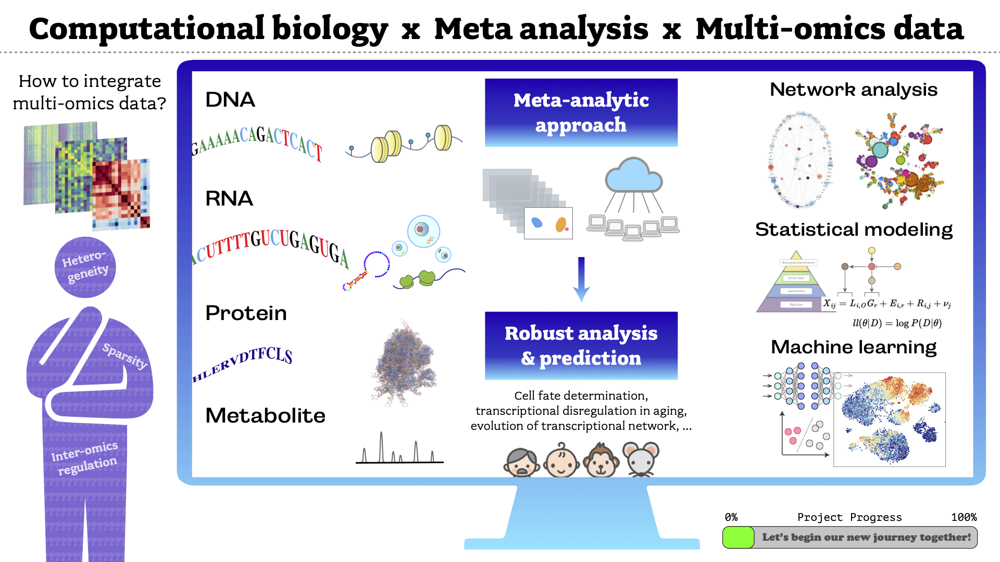

Computational biology lab towards understanding a ubiquitous mechanism to regulate intra- and inter-cellullar variations.

# {.row}

  
News

  

  We are recruiting Office Assistant students of Kyoto University.
Please contact me via *rkawaguchi-g at cira.kyoto-u.ac.jp* if you have an interest. We would like to welcome research interns and JSPS research fellows for collaboration as well.

 
 

## History {.col-md-9}
- 2023.04.20 Updated.
- 2023.03.08 Updated.
- 2022.12.22 Updated.
- 2022.09.22 Launched this website.

