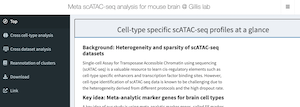

## Affiliation
* [河口研究室@東大](https://www.f.u-tokyo.ac.jp/research/index.html?id=1377181381#_1733126180)
* [Kawaguchi Lab @ UTokyo](https://www.f.u-tokyo.ac.jp/en/research/index.html#cate1)
* [河口研究室@CiRA](https://www.cira.kyoto-u.ac.jp/j/research/rkawaguchi_summary.html)
* [Kawaguchi Lab @ CiRA](https://www.cira.kyoto-u.ac.jp/e/research/rkawaguchi_summary.html)

## Research
* [Meta scATAC server](https://gillisweb.cshl.edu/Meta_scATAC/)
  - 
  - 

## Talk videos
* 2025

<iframe width="560" height="315" src="https://www.youtube.com/embed/_dNzEEcv5QE?si=BF6iebSwYg5kS71Q" title="YouTube video player" frameborder="0" allow="accelerometer; autoplay; clipboard-write; encrypted-media; gyroscope; picture-in-picture; web-share" referrerpolicy="strict-origin-when-cross-origin" allowfullscreen></iframe>

* 2023

<iframe width="560" height="315" src="https://www.youtube.com/embed/6Z3-XXlIG2E?si=jGPqCgoukI76O3cC" frameborder="0" allowfullscreen></iframe>

* 2022

<iframe width="560" height="315" src="https://www.youtube.com/embed/jmrGXam7Hys?si=zF17T23Fl9BZoFuj
" frameborder="0" allowfullscreen></iframe>

* 2021

<iframe width="560" height="315" src="https://www.youtube.com/embed/Loc6RvchWgc?si=NTljVTr4IblpBcoQ" title="YouTube video player" frameborder="0" allow="accelerometer; autoplay; clipboard-write; encrypted-media; gyroscope; picture-in-picture; web-share" referrerpolicy="strict-origin-when-cross-origin" allowfullscreen></iframe>

* 2020

<iframe width="560" height="315" src="https://www.youtube.com/embed/_cdr7B04ub0?si=PNtXav-oARbwWryw" frameborder="0" allowfullscreen></iframe>

