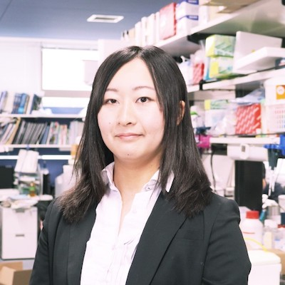

<br>

# Members {.row}
##  {.col-md-8}

### 河口理紗（Risa K Kawaguchi）
- [個人サイト](https://sites.google.com/site/cawatchm/)
- [google scholar](https://scholar.google.com/citations?user=BLtM6hoAAAAJh)
- [carushi@github](https://github.com/carushi)
- [𝕏](https://twitter.com/can_pyong)

```{r, echo=FALSE}
eval("Risa ~ curiosity + computer + bio + patience + 0.1 serendipity")
```

<br>
<br>

### スタッフ
- 隅内　千賀子（東大・アシスタント）
- 大久保 周子（京大・外来研究員）

### 学生

- 徐　锐琪（京大・大学院生）
- 佐々木　孝太（東大薬・B4）
- 中野　陽向（東大薬・B4）


### 卒業生

- 肖　睿（インターン）2025 夏季
- 二上　麻央（インターン）2025 夏季
- Mona Sheta （外来研究員）2023 夏季
- 伊藤 恵理（インターン）2023 夏季
- ツッカ タドウ（インターン）2023 夏季
- 崔 岩（インターン）2023 夏季
- 森本 由起（秘書・技術補佐）2023-2024


## {.col-md-4 }




